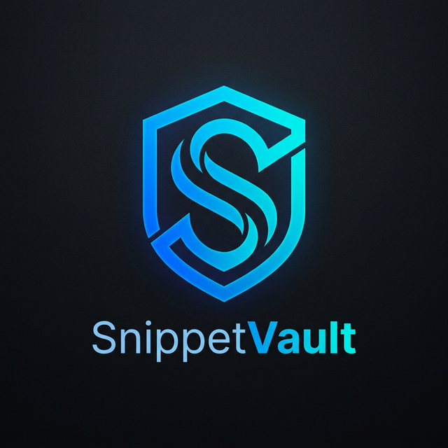
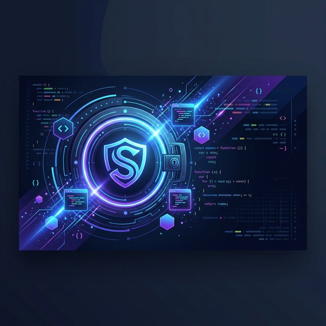
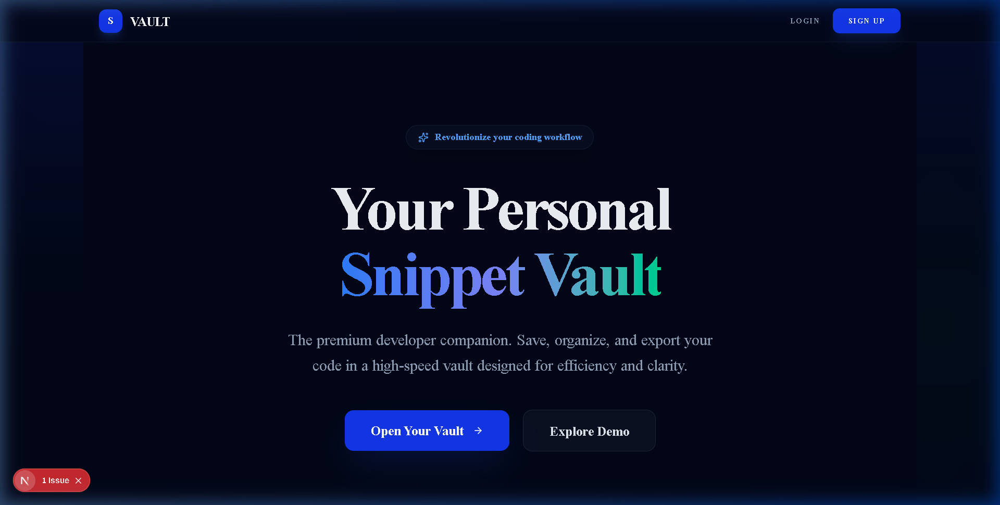
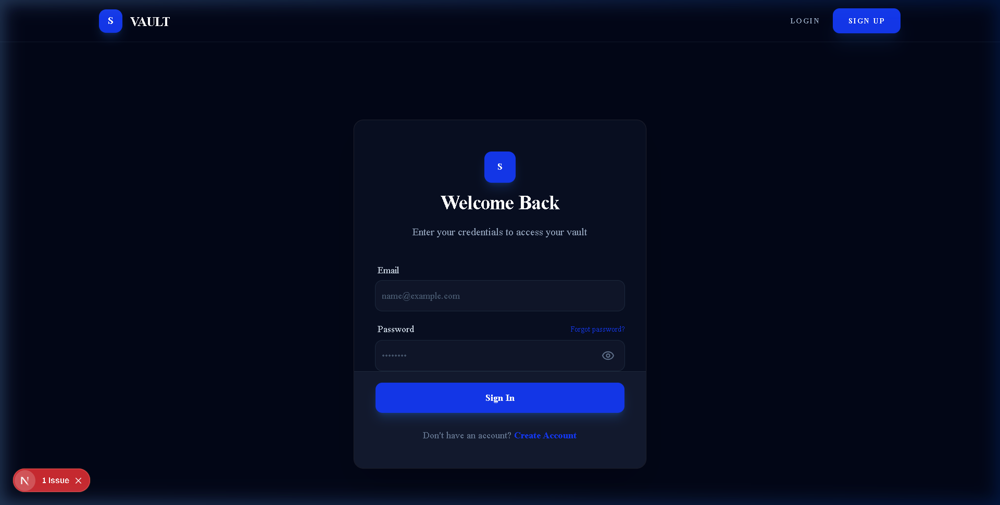

# 💎 SnippetVault

<p align="center">
  
</p>

<p align="center">
  <strong>The premium code snippet manager for modern developers.</strong><br>
  Secure, elegant, and blazing fast.
</p>

<p align="center">
  
  
  
  
</p>

---



## ✨ Features

- **🚀 Instant Organization**: Tag and categorize your logic with a multi-tag system.
- **🔐 Secure by Design**: Built on Supabase with robust **Row Level Security (RLS)**.
- **🎨 Premium UI**: A dark-themed, glassmorphic interface inspired by the best developer tools.
- **📱 Responsive**: Perfectly optimized for desktop and mobile workflows.
- **💾 Export**: Save your code snippets as beautiful images for sharing.
- **🌐 Public Profiles**: Showcase your collection with a personalized public profile page.

## 📸 Preview

<div align="center">
  <p><strong>Landing Page</strong></p>
  
  <p><strong>Secure Authentication</strong></p>
  
</div>

## 🛠️ Tech Stack

- **Framework**: [Next.js](https://nextjs.org/) (App Router)
- **Styling**: [Tailwind CSS 4.0](https://tailwindcss.com/) & [shadcn/ui](https://ui.shadcn.com/)
- **Database & Auth**: [Supabase](https://supabase.com/)
- **State Management**: [TanStack Query](https://tanstack.com/query) & [Zustand](https://github.com/pmndrs/zustand)
- **Icons**: [Lucide React](https://lucide.dev/)
- **Notifications**: [Sonner](https://sonner.emilkowal.ski/)

## 🚀 Getting Started

### 1. Clone & Install
```bash
git clone https://github.com/yourusername/snippetvault.git
cd snippetvault
npm install
```

### 2. Configure Environment
Copy `.env.example` to `.env.local` and add your Supabase credentials:
```bash
NEXT_PUBLIC_SUPABASE_URL=your-project-url
NEXT_PUBLIC_SUPABASE_ANON_KEY=your-anon-key
```

### 3. Database Setup
1. Run `supabase_setup.sql` in your Supabase SQL Editor to initialize tables and RLS policies.
2. Sign up for an account via the UI.
3. (Optional) Run `seed_data.sql` to populate your vault with 8+ professional snippets.

### 4. Run Development Server
```bash
npm run dev
```

## 📦 Deployment

SnippetVault is optimized for **Vercel**. 

### Quick Deploy
1. Push your code to GitHub.
2. Import the project into Vercel.
3. Add the following [Environment Variables](file:///C:/Users/piyus/.gemini/antigravity/brain/73e8bf33-d452-424d-9b44-6cadde07483f/deployment_guide.md):
   - `NEXT_PUBLIC_SUPABASE_URL`
   - `NEXT_PUBLIC_SUPABASE_ANON_KEY`

For detailed instructions, see the [Deployment Guide](file:///C:/Users/piyus/.gemini/antigravity/brain/73e8bf33-d452-424d-9b44-6cadde07483f/deployment_guide.md).

---

<p align="center">
  Built with ❤️ by the SnippetVault Team
</p>
